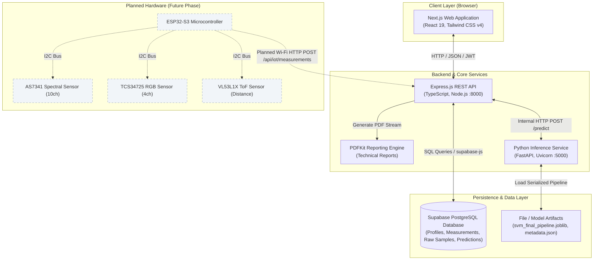
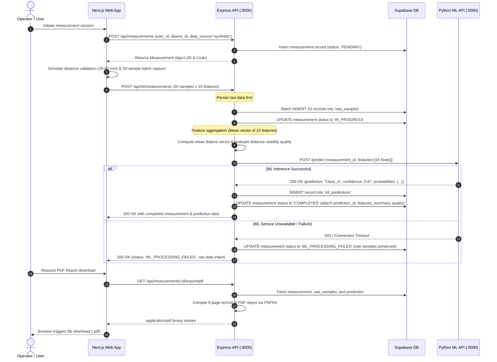
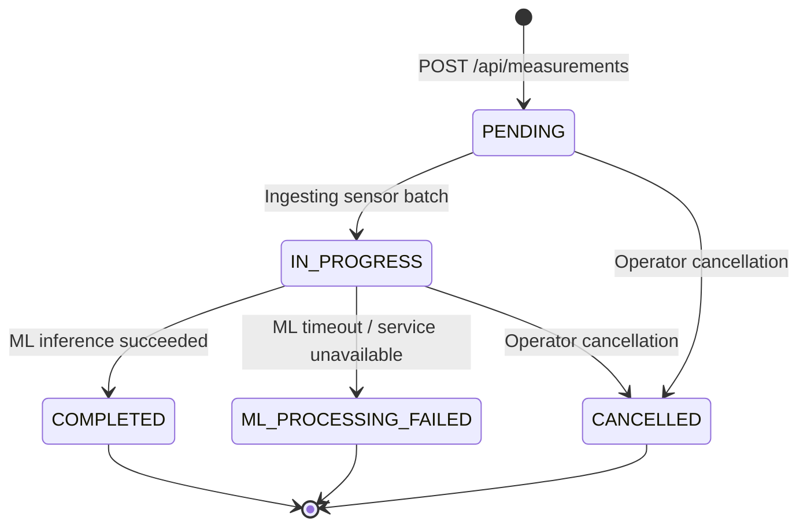
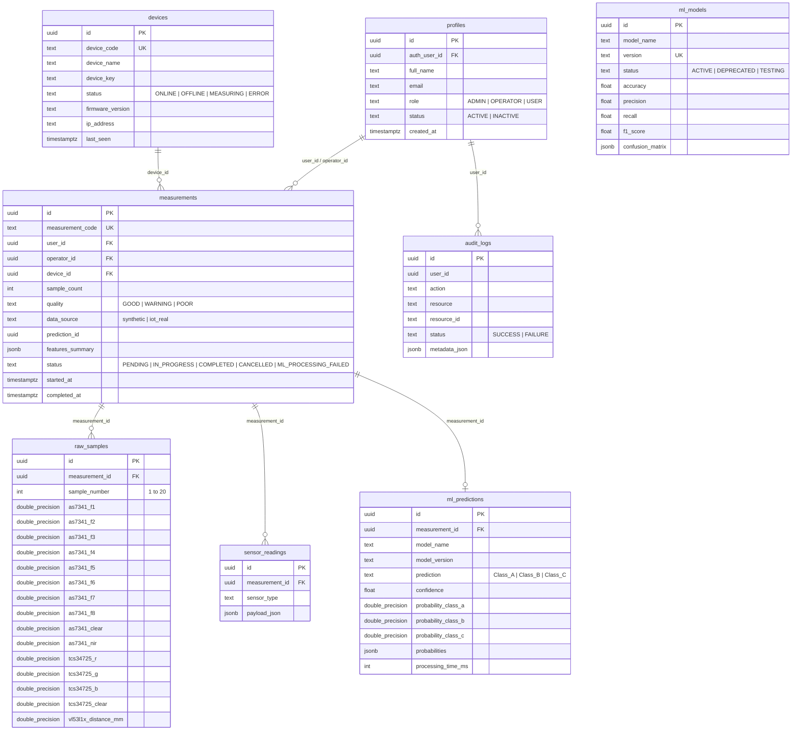

# PHENOTYPE
## Multi-Sensor Monitoring & Classification Web Application

> **Current Implementation State:** Fully functional software-only multi-sensor monitoring, simulation, and classification platform. Physical ESP32-S3 microcontroller and optical sensor integration is currently planned / in development. All current measurements and machine learning evaluations utilize synthetic / simulation data.

---

## Table of Contents

1. [Project Overview](#project-overview)
2. [Current Project Status](#current-project-status)
3. [Research Scope & Boundaries](#research-scope--boundaries)
4. [System Architecture](#system-architecture)
5. [End-to-End Data Flow](#end-to-end-data-flow)
6. [Technology Stack](#technology-stack)
7. [Multi-Sensor Feature Vector](#multi-sensor-feature-vector)
8. [Machine Learning Pipeline](#machine-learning-pipeline)
   - [Dataset Specifications](#dataset-specifications)
   - [Data Leakage Prevention & Validation Strategy](#data-leakage-prevention--validation-strategy)
   - [Model Architecture & Hyperparameter Tuning](#model-architecture--hyperparameter-tuning)
   - [Evaluation Metrics & Benchmark Results](#evaluation-metrics--benchmark-results)
   - [Sensor Ablation Study](#sensor-ablation-study)
   - [Feature Permutation Importance](#feature-permutation-importance)
   - [Python ML Inference Service (FastAPI)](#python-ml-inference-service-fastapi)
9. [Measurement Lifecycle & Quality Rating](#measurement-lifecycle--quality-rating)
10. [Backend Architecture & Implementation](#backend-architecture--implementation)
    - [Architecture Overview](#architecture-overview)
    - [Security & Authentication](#security--authentication)
    - [PDF Reporting Service](#pdf-reporting-service)
11. [Frontend Implementation (Next.js)](#frontend-implementation-nextjs)
    - [Implemented Pages & Workflows](#implemented-pages--workflows)
    - [State Management & API Communication](#state-management--api-communication)
12. [Database Schema (Supabase / PostgreSQL)](#database-schema-supabase--postgresql)
13. [Complete API Reference](#complete-api-reference)
14. [Repository Structure](#repository-structure)
15. [Environment Variables](#environment-variables)
16. [Installation & Local Setup](#installation--local-setup)
17. [Testing & Quality Verification](#testing--quality-verification)
18. [Current Limitations](#current-limitations)
19. [Hardware Integration Roadmap](#hardware-integration-roadmap)
20. [Academic & Research Disclaimer](#academic--research-disclaimer)
21. [Author & License](#author--license)

---

## Project Overview

**PHENOTYPE** is an academic research and engineering platform designed to investigate multi-sensor data fusion and pattern classification. The platform integrates a modern web interface, an Express.js REST API, a Supabase PostgreSQL database, and a specialized Python machine learning service utilizing Support Vector Machines (SVM).

The system models the acquisition of optical spectral, RGB color, and time-of-flight (ToF) distance channels to classify data into predefined target research classes (`Class_A`, `Class_B`, and `Class_C`). 

```
┌─────────────────┐      HTTP / REST       ┌──────────────────────┐      SQL / REST      ┌──────────────────┐
│ Next.js 16      │ ────────────────────>  │ Express.js Backend   │ ───────────────────> │ Supabase         │
│ Web Application │ <────────────────────  │ (TypeScript, Port 8k)│ <─────────────────── │ (PostgreSQL DB)  │
└─────────────────┘                        └──────────┬───────────┘                      └──────────────────┘
                                                      │
                                                      │ HTTP / REST
                                                      │ (Internal Server-to-Server)
                                                      v
                                           ┌──────────────────────┐
                                           │ Python ML Service    │
                                           │ (FastAPI, Port 5000) │
                                           │ Scikit-Learn SVM     │
                                           └──────────────────────┘
```

---

## Current Project Status

| Component | Status | Implementation Details |
|---|---|---|
| **Frontend Web App** | **Functional** | Next.js 16 (App Router), React 19, Tailwind CSS v4, dynamic charts, PDF export triggers. |
| **Backend REST API** | **Functional** | Node.js, Express.js 4, TypeScript 5, Zod validation, JWT authentication, rate limiting, PDFKit engine. |
| **Database & Storage** | **Functional** | Supabase PostgreSQL schema with 8 relational tables, raw sample batching, audit logging. |
| **ML Training Pipeline** | **Functional** | Scikit-learn 15-phase pipeline, subject-level split, GridSearchCV tuning, permutation importance. |
| **ML Inference Service** | **Functional** | FastAPI service on port 5000 serving serialized `StandardScaler + SVC` pipeline (`svm_final_pipeline.joblib`). |
| **Multi-Sample Ingestion** | **Functional** | 20 raw samples per measurement session (15 features/sample), aggregated via mean feature extraction. |
| **PDF Reporting Engine** | **Functional** | Multi-page automated technical PDF measurement reports generated on backend via PDFKit. |
| **Software Simulation** | **Functional** | Client-side and server-side sensor simulation generator mimicking optical and ToF characteristics. |
| **Physical IoT Hardware** | **Planned** | Target hardware: ESP32-S3 MCU with AS7341, TCS34725, VL53L1X, and OLED display. |
| **Real Hardware Telemetry** | **Pending** | Live Wi-Fi, IP negotiation, and physical sensor telemetry are awaiting physical hardware deployment. |
| **Human Biological Validation**| **Pending** | Current model is trained exclusively on synthetic research simulation data. |
| **External STIFIn Integration** | **Pending** | Awaiting official external data contracts, schema definitions, and scanner output specifications. |

---

## Research Scope & Boundaries

To preserve scientific and academic rigor, the following research boundaries are strictly enforced throughout this project:

1. **Synthetic / Simulation Data Only:** The current machine learning model and backend measurement processing operate exclusively on synthetic/simulated sensor records.
2. **Classification Labels:** The classes `Class_A`, `Class_B`, and `Class_C` are abstract, research-defined category labels. They have **no biological, genetic, racial, ethnic, medical, personality, or STIFIn assessment meaning**.
3. **No Biological / Genetic Scanning:** Optical and distance sensors do not read DNA, chromosomes, or biological genotypes.
4. **No Medical Claims:** PHENOTYPE is an engineering prototype and research system; it is not a diagnostic tool or clinical medical device.
5. **Pending External STIFIn Contract:** While intended to explore replacement possibilities for legacy biometric scanners, the data exchange format, scanner output schema, and integration contract are owned by external third parties and are unconfigured in production.

---

## System Architecture

The software architecture consists of decoupled layers communicating via standard HTTP REST protocols and PostgreSQL connections:



---

## End-to-End Data Flow

The operational measurement and inference data flow proceeds through the following sequential stages:



---

## Technology Stack

### Frontend
- **Framework:** Next.js 16.3.4 (App Router)
- **UI Library:** React 19.2.8
- **Styling:** Tailwind CSS v4, PostCSS
- **Animations & Icons:** GSAP 3.15, Lucide React
- **Language:** TypeScript 5
- **Communication:** Native Fetch API client with automatic JWT token expiration checks and 401 interceptors

### Backend
- **Runtime:** Node.js (v20+ / v22+)
- **Framework:** Express.js 4.21.2
- **Language:** TypeScript 5.7.3 (executed via `ts-node-dev` in development, compiled via `tsc` for production)
- **Validation:** Zod 3.24.2 for request schema validation
- **Security:** Helmet 8.0, CORS, express-rate-limit
- **Reporting:** PDFKit 0.20.2
- **Database Client:** `@supabase/supabase-js` 2.48.1
- **HTTP Client:** Axios 1.7.9 (server-to-server ML service communication)

### Database & Auth
- **Provider:** Supabase / PostgreSQL
- **Authentication:** Supabase Auth with custom application user profiles (`public.profiles`)
- **Row-Level Security:** Configured with role-based authorization (`ADMIN`, `OPERATOR`, `USER`)

### Machine Learning & Data Science
- **Language:** Python 3.11 / 3.14
- **Framework:** FastAPI 0.100+, Uvicorn 0.20+, Pydantic 2.0+
- **Data Manipulation:** pandas >= 2.0.0, NumPy >= 1.24.0, SciPy >= 1.10.0
- **Model Engine:** scikit-learn >= 1.3.0 (Pipeline, StandardScaler, SVC, StratifiedGroupKFold, GroupShuffleSplit)
- **Visualization:** Matplotlib >= 3.7.0, Seaborn >= 0.12.0
- **Model Serialization:** Joblib >= 1.3.0
- **Testing:** Pytest >= 7.0.0

---

## Multi-Sensor Feature Vector

The system captures and processes a canonical **15-dimensional numerical feature vector** structured across three distinct sensor modalities:

| Sensor | Physical Modality | Output Channels / Features | Count | Description / Spectrum |
|---|---|---|---|---|
| **AS7341** | Multi-channel Visible & NIR Spectral | `AS7341_F1`<br>`AS7341_F2`<br>`AS7341_F3`<br>`AS7341_F4`<br>`AS7341_F5`<br>`AS7341_F6`<br>`AS7341_F7`<br>`AS7341_F8`<br>`AS7341_Clear`<br>`AS7341_NIR` | 10 | • F1: 415 nm (Violet)<br>• F2: 445 nm (Indigo)<br>• F3: 480 nm (Blue)<br>• F4: 515 nm (Cyan)<br>• F5: 555 nm (Green)<br>• F6: 590 nm (Yellow)<br>• F7: 630 nm (Red)<br>• F8: 680 nm (Deep Red)<br>• Clear: Broad spectrum visible<br>• NIR: 910 nm (Near-Infrared) |
| **TCS34725** | Color Light-to-Digital Converter | `TCS34725_R`<br>`TCS34725_G`<br>`TCS34725_B`<br>`TCS34725_Clear` | 4 | • Red channel irradiance<br>• Green channel irradiance<br>• Blue channel irradiance<br>• Clear photodiode broadband |
| **VL53L1X** | Time-of-Flight (ToF) Distance | `VL53L1X_Distance_mm` | 1 | Distance between the optical sensor aperture and the target surface in millimeters |
| **Total** | | | **15** | **Canonical feature ordering enforced across ML & API layers** |

> **Note on Measurement Positioning:** The VL53L1X distance channel is used to enforce target positioning within the nominal range of **35 mm to 50 mm**.

---

## Machine Learning Pipeline

### Dataset Specifications
The machine learning pipeline is developed and validated on a synthetic dataset designed to replicate multi-sensor characteristics across repeated subject interactions:

- **Source File:** `ml/data/processed/synthetic_final_cleaned.csv`
- **Total Subjects:** 500 unique synthetic subjects (`subject_0001` to `subject_0500`)
- **Measurements per Subject:** Exactly 5 repeated measurements
- **Total Rows:** 2,500 observations
- **Target Classes:** 3 balanced classes (`Class_A`, `Class_B`, `Class_C`)
- **Class Distribution:** Approximately equal representation across subjects

### Data Leakage Prevention & Validation Strategy

A core risk in repeated-measurement machine learning is **subject-level data leakage** (where measurements from the same subject appear in both training and test sets, artificially inflating accuracy).

The pipeline enforces rigorous isolation verified by `ml/results/metrics/data_leakage_audit.md`:

```
All Subjects (500 subjects / 2,500 rows)
                    │
                    ▼
     Subject-Level GroupShuffleSplit (80% / 20%)
         │                               │
         ▼                               ▼
Training Split (400 subjects)    Test Split (100 subjects)
2,000 observations               500 observations
(Strictly isolated)              (Strictly held out until final evaluation)
         │
         ▼
5-Fold StratifiedGroupKFold
Cross-Validation (Training only)
         │
         ▼
StandardScaler (Embedded in Pipeline)
Fitted exclusively on training folds
```

- **Subject Isolation:** `GroupShuffleSplit(test_size=0.20, random_state=42)` guarantees that the intersection of training subjects and testing subjects is strictly empty (`train ∩ test = ∅`).
- **Pipeline-Enclosed Scaling:** `StandardScaler` is wrapped inside an `sklearn.pipeline.Pipeline`. The scaler is fitted strictly on the training partition and only transforms validation/test partitions.
- **Cross-Validation:** Hyperparameter tuning is conducted using 5-Fold `StratifiedGroupKFold` on the 400 training subjects only.
- **Metadata Exclusion:** `subject_id`, `measurement_id`, and `measurement_index` are strictly stripped from the feature matrix $X$.

### Model Architecture & Hyperparameter Tuning

- **Base Classifier:** Support Vector Classifier (`sklearn.svm.SVC`) with probability estimation enabled (`probability=True`).
- **Hyperparameter Grid Search:** Evaluated linear and RBF kernels across $C \in \{0.1, 1, 10, 100\}$ and $\gamma \in \{\text{'scale'}, 0.001, 0.01, 0.1, 1\}$.
- **Selected Best Model:**
  - **Pipeline:** `StandardScaler` $\rightarrow$ `SVC(kernel='linear', C=1.0, probability=True)`
  - **Decision Function:** One-vs-Rest (OvR) multi-class classification

### Evaluation Metrics & Benchmark Results

The following metrics represent actual evaluated results on the 100-subject (500 observation) held-out test split, as recorded in `ml/models/metadata.json` and `ml/results/metrics/final_metrics.csv`:

| Evaluation Metric | Final Test Score | 5-Fold Group CV Score (Training Set) |
|---|---|---|
| **Overall Accuracy** | **80.00%** | — |
| **Macro Precision** | **78.21%** | — |
| **Macro Recall** | **78.94%** | — |
| **Macro F1-Score** | **78.41%** | **69.80% ± 4.04%** |
| **Weighted F1-Score** | **80.30%** | — |

#### Per-Class Breakdown (Held-out Test Split, N=500)
Source: `ml/results/metrics/classification_report.csv`

| Class | Precision | Recall | F1-Score | Support (Observations) |
|---|---|---|---|---|
| **Class_A** | 87.08% | 81.58% | 84.24% | 190 |
| **Class_B** | 62.50% | 72.73% | 67.23% | 110 |
| **Class_C** | 85.05% | 82.50% | 83.76% | 200 |
| **Macro Average** | **78.21%** | **78.94%** | **78.41%** | 500 |
| **Weighted Average**| **80.86%** | **80.00%** | **80.30%** | 500 |

#### Baseline Algorithm Comparison
Source: `ml/results/metrics/baseline_comparison.csv`

| Algorithm | Test Accuracy | Test Macro F1 | 5-Fold CV Macro F1 Mean | 5-Fold CV Std |
|---|---|---|---|---|
| **Logistic Regression** | 80.40% | 78.86% | 69.95% | ± 4.25% |
| **SVM (Tuned Linear, C=1)** | **80.00%** | **78.41%** | **69.80%** | **± 4.04%** |
| **SVM (Baseline RBF)** | 78.00% | 75.43% | 63.85% | ± 3.16% |
| **Random Forest** | 74.20% | 71.21% | 65.22% | ± 3.18% |
| **K-Nearest Neighbors (KNN)** | 66.80% | 65.00% | 56.40% | ± 3.20% |

### Sensor Ablation Study
Source: `ml/results/metrics/ablation_results.csv`

An ablation study evaluated the contribution of individual sensors and paired combinations:

| Sensor Configuration | Channel Count | Test Accuracy | Test Macro F1 | Key Takeaway |
|---|---|---|---|---|
| **AS7341 + TCS34725** | 14 | 81.20% | 79.84% | Highest F1 score; optical spectral + color synergy |
| **All Sensors (Standard)** | 15 | 80.00% | 78.41% | Full multimodal pipeline with distance validation |
| **AS7341 + VL53L1X** | 11 | 70.80% | 68.06% | Spectral + distance check |
| **TCS34725 + VL53L1X** | 5 | 69.20% | 68.48% | Color + distance check |
| **AS7341 Only** | 10 | 69.20% | 65.98% | Spectral channels alone |
| **TCS34725 Only** | 4 | 68.00% | 67.31% | Color channels alone |
| **VL53L1X Only** | 1 | 45.60% | 37.28% | Distance alone cannot perform multi-class discrimination |

### Feature Permutation Importance
Evaluated via `sklearn.inspection.permutation_importance` on the test partition:
- **Top Predictive Features:** `TCS34725_B` (+14.23%), `AS7341_F1` (+12.04%), `TCS34725_R` (+11.63%), `AS7341_F5` (+7.70%), and `TCS34725_G` (+7.13%).
- **Lower Contribution Channels:** `VL53L1X_Distance_mm` (+0.37%), `AS7341_Clear` (+0.21%), and `AS7341_NIR` (-0.18%).

### Python ML Inference Service (FastAPI)
The service in `ml/api.py` exposes:
- `GET /health`: Returns service health, loaded model status, 15 feature names, and label disclaimers.
- `POST /predict`: Receives canonical 15-float feature arrays or sensor key-value dictionaries. Returns predicted class, confidence, individual class probabilities, and model version.

---

## Measurement Lifecycle & Quality Rating

### Measurement State Machine
Measurements progress through strictly defined database statuses:



In the frontend UI workflow (`frontend/app/(dashboard)/measurement/page.tsx`), the interactive execution is tracked via detailed client states:
1. `IDLE`: Form initialized, device selected, data source configured.
2. `START_REQUESTED`: Measurement session registered on backend (`POST /api/measurements`).
3. `DISTANCE_VALIDATION`: Simulates positioning feedback from ToF sensor (35–50 mm window).
4. `MEASURING`: Progressively samples 20 readings across the 15 sensor channels.
5. `PROCESSING`: Sends 20-sample batch to `POST /api/iot/measurements`, triggering feature aggregation and ML prediction.
6. `COMPLETED`: Prediction received and displayed alongside probabilities and confidence metrics.
7. `FAILED`: Displays error notice while preserving session recovery options.

### Sample Batching & Mean Aggregation
Each measurement session captures **20 raw sensor samples**. Each sample contains the full 15 features.
- All 20 raw samples are permanently saved to the `raw_samples` database table.
- The backend calculates the arithmetic mean for each of the 15 features across the 20 samples to form the summary vector passed to the SVM model.

### Measurement Quality Evaluation
Quality is programmatically evaluated based on positioning stability:
- **`GOOD`**: Average distance is within 35.0 mm – 50.0 mm, and distance standard deviation across the 20 samples is $\le 2.0\text{ mm}$.
- **`WARNING`**: Average distance falls outside 35.0 mm – 50.0 mm, or distance standard deviation is between $2.0\text{ mm}$ and $8.0\text{ mm}$.
- **`POOR`**: Average distance is $\le 0\text{ mm}$, or distance standard deviation exceeds $8.0\text{ mm}$.

---

## Backend Architecture & Implementation

### Architecture Overview
The backend follows a layered architecture implemented in TypeScript:
- **Routes (`src/routes/`):** Request mapping, route authentication, and role authorization.
- **Controllers (`src/controllers/`):** Request parsing, response formatting, and status code management.
- **Services (`src/services/`):** Business logic, feature aggregation, ML service invocation, and PDF generation.
- **Repositories (`src/repositories/`):** Data access layer encapsulating Supabase PostgreSQL queries.
- **Middlewares (`src/middlewares/`):** JWT verification (`authenticate`), RBAC (`authorize`), device API key authentication (`deviceAuth`), input validation (`validate`), rate limiting, and centralized error handling.
- **Validators (`src/validators/`):** Zod schemas ensuring strict type validation at runtime.

### Security & Authentication
- **User Authentication:** Dual support for Supabase Auth JWTs and custom JWT verification signed by `JWT_SECRET`.
- **Role-Based Access Control (RBAC):** Three user roles: `ADMIN`, `OPERATOR`, and `USER`.
- **Device Authentication:** IoT endpoints (`/api/iot/*`) use header-based device authentication (`x-device-key` and `x-device-code`).
- **Rate Limiting:** General API limiter (`100 req / 15 min`) and stricter auth limiter (`10 req / 15 min`).

### PDF Reporting Service
The `MeasurementPdfService` (`backend/src/services/measurementPdfService.ts`) compiles an automated multi-page technical report:
- **Page 1:** Measurement summary, quality indicator, predicted class, and confidence score.
- **Page 2:** Signal stability analysis, coefficient of variation (CV), linear regression trend ($R^2$), cross-sensor Pearson correlation, and motion evidence indicators.
- **Page 3–4:** Technical positioning metrics (mean, min, max distance) and device metadata.
- **Page 5:** Grouped sensor summary tables (AS7341, TCS34725, VL53L1X).
- **Page 6:** Machine learning classification breakdown (individual class probabilities).
- **Page 7:** Model benchmark summary, cross-validation metrics, and sensor ablation context.
- **Page 8:** Methodology notes and academic disclaimers.
- **Page 9–10:** Complete raw sensor data log (20 samples $\times$ 15 features).

---

## Frontend Implementation (Next.js)

### Implemented Pages & Workflows

1. **Landing Page (`/`):**
   - High-level project overview, interactive sensor modality breakdown, technology architecture, and academic disclaimers.
2. **Authentication Pages (`/login`, `/register`):**
   - User sign-in and registration with form validation, token storage (`phenotype_token`), and session restoration.
3. **Dashboard (`/dashboard`):**
   - High-level overview cards (device status, measurement counts, latest result), recent measurement stream, and fast action triggers.
4. **New Measurement (`/measurement`):**
   - Interactive measurement execution interface featuring real-time state transitions, distance positioning check, 20-sample animation, ML result cards, and one-click PDF report download.
5. **Measurement History (`/history`):**
   - Paginated tabular history with multi-parameter filtering (status, data source, predicted class, quality, date range).
   - Modal view displaying measurement summary, raw 20-sample inspection table, and CSV/PDF export options.
6. **Analytics & ML Performance (`/analytics`):**
   - Comprehensive model validation dashboard displaying actual experiment results: 80.0% accuracy card, 500-sample confusion matrix, classification report, sensor ablation bar charts, and feature permutation ranking.
7. **Device Management (`/device`):**
   - Registered IoT hardware node list, registration modal for new devices, firmware tracking, and explicit indicators stating that physical hardware telemetry is pending.
8. **Settings (`/settings`):**
   - Account settings and local threshold configuration tabs (measurement timeout, distance boundaries).

### State Management & API Communication
- Centralized `ApiClient` in `frontend/lib/api.ts` wrapping native `fetch`.
- Automatically checks JWT expiration client-side via base64 payload decoding.
- Global 401 interceptor purges expired tokens and fires `phenotype:auth:401` custom events for automatic redirection to login.
- File streaming helper (`downloadFile`) for direct client downloads of generated CSV and PDF files.

---

## Database Schema (Supabase / PostgreSQL)

The database schema (`backend/supabase_schema.sql`) consists of 8 core relational tables:



---

## Complete API Reference

All backend endpoints are prefixed with `/api`. Authenticated endpoints require `Authorization: Bearer <token>`.

### Authentication (`/api/auth`)
| Endpoint | Method | Auth | Access | Purpose |
|---|---|---|---|---|
| `/auth/register` | `POST` | Public | All | Register a new user profile and return auth token |
| `/auth/login` | `POST` | Public | All | Authenticate user credentials and return auth token |
| `/auth/me` | `GET` | Bearer | All | Get current authenticated user profile |

### Users Management (`/api/users`)
| Endpoint | Method | Auth | Access | Purpose |
|---|---|---|---|---|
| `/users` | `GET` | Bearer | `ADMIN` | List user profiles with pagination |
| `/users` | `POST` | Bearer | `ADMIN` | Create user profile directly |
| `/users/:id` | `GET` | Bearer | All | Retrieve user profile by ID |
| `/users/:id` | `PATCH` | Bearer | Self / `ADMIN` | Update user profile details |
| `/users/:id` | `DELETE` | Bearer | `ADMIN` | Delete user profile |

### Device Management (`/api/devices`)
| Endpoint | Method | Auth | Access | Purpose |
|---|---|---|---|---|
| `/devices` | `GET` | Bearer | `ADMIN`, `OPERATOR` | List registered hardware devices |
| `/devices` | `POST` | Bearer | `ADMIN` | Register a new hardware device |
| `/devices/:id` | `GET` | Bearer | `ADMIN`, `OPERATOR` | Get hardware device details by ID |
| `/devices/:id` | `PATCH` | Bearer | `ADMIN` | Update device name, status, or firmware version |

### IoT & Ingestion Endpoints (`/api/iot`)
| Endpoint | Method | Auth | Access | Purpose |
|---|---|---|---|---|
| `/iot/measurements` | `POST` | Device Key | Hardware / Sim | Ingest 20 raw sensor samples, run SVM prediction |
| `/iot/heartbeat` | `POST` | Device Key | Hardware / Sim | Update device last-seen timestamp |
| `/iot/device-status` | `POST` | Device Key | Hardware / Sim | Update device operating status |
| `/iot/devices/:deviceId/status` | `GET` | Bearer | All | Query device runtime status |

### Measurements Management (`/api/measurements`)
| Endpoint | Method | Auth | Access | Purpose |
|---|---|---|---|---|
| `/measurements` | `GET` | Bearer | All | List measurements with pagination & filters |
| `/measurements` | `POST` | Bearer | All | Initialize a new measurement session (`PENDING`) |
| `/measurements/export/csv` | `GET` | Bearer | All | Download measurements list as CSV |
| `/measurements/export/raw-csv` | `GET` | Bearer | All | Download raw 20-sample sensor readings as CSV |
| `/measurements/:id` | `GET` | Bearer | All | Retrieve measurement by ID including prediction |
| `/measurements/:id/raw-samples` | `GET` | Bearer | All | Retrieve 20 individual raw samples for measurement |
| `/measurements/:id/export/pdf` | `GET` | Bearer | All | Stream compiled 9-page technical measurement PDF |
| `/measurements/:id/status` | `PATCH` | Bearer | `ADMIN`, `OPERATOR` | Manually update measurement status |
| `/measurements/:id/sensors` | `GET` | Bearer | All | Retrieve legacy sensor readings payloads |

### Machine Learning (`/api/ml`)
| Endpoint | Method | Auth | Access | Purpose |
|---|---|---|---|---|
| `/ml/predictions/:measurementId` | `GET` | Bearer | All | Retrieve SVM prediction record for a measurement |
| `/ml/models` | `GET` | Bearer | `ADMIN` | List registered ML models and evaluation metrics |
| `/ml/models/:id` | `GET` | Bearer | `ADMIN` | Retrieve specific ML model metadata |

### Analytics & System Health (`/api/analytics`, `/api/health`)
| Endpoint | Method | Auth | Access | Purpose |
|---|---|---|---|---|
| `/analytics/measurements` | `GET` | Bearer | `ADMIN` | Measurement status volume statistics |
| `/analytics/predictions` | `GET` | Bearer | `ADMIN` | Class distribution statistics |
| `/analytics/sources` | `GET` | Bearer | `ADMIN` | Data source breakdown (synthetic vs iot_real) |
| `/analytics/devices` | `GET` | Bearer | `ADMIN` | Device status count summary |
| `/analytics/model-performance` | `GET` | Bearer | `ADMIN` | Model accuracy, F1, and confusion matrix summary |
| `/analytics/patterns/:measurementId`| `GET` | Bearer | `ADMIN` | Stability, CV, slope, and cross-sensor correlations |
| `/audit-logs` | `GET` | Bearer | `ADMIN` | Retrieve system audit logs |
| `/assessments/:measurementId` | `GET` | Bearer | All | Retrieve research assessment mapping |
| `/health` | `GET` | Public | All | Backend uptime and health check |

### Python ML Microservice Endpoints (Port 5000)
| Endpoint | Method | Auth | Purpose |
|---|---|---|---|
| `/health` | `GET` | Public | Service health, model loaded flag, 15 canonical feature names |
| `/predict` | `POST` | Public / Server | Run SVM inference on 15 features; returns prediction, confidence, probabilities |

---

## Repository Structure

```
phenotype-r/
├── .gitignore
├── README.md
├── backend/
│   ├── .env.example
│   ├── package.json
│   ├── tsconfig.json
│   ├── supabase_schema.sql          # Core 8-table relational schema
│   ├── migration_update_v2.sql      # Schema migrations
│   └── src/
│       ├── server.ts                # Application entry point & graceful shutdown
│       ├── app.ts                   # Express configuration, helmet, cors, rate limiting
│       ├── config/                  # Environment parsing (env.ts) & assessment mappings
│       ├── controllers/             # Express route controllers
│       ├── middlewares/             # Auth, deviceAuth, authorize, validation, error handler
│       ├── repositories/            # Supabase database access layer
│       ├── routes/                  # Express route declarations
│       ├── services/                # MeasurementService, MeasurementPdfService, MlService
│       ├── types/                   # TypeScript interfaces & database entity definitions
│       ├── utils/                   # Logger, standardized response helpers, custom errors
│       └── validators/              # Zod validation schemas
├── frontend/
│   ├── .env.example
│   ├── package.json
│   ├── tsconfig.json
│   ├── next.config.ts
│   ├── app/
│   │   ├── layout.tsx               # Root layout & global AuthProvider
│   │   ├── page.tsx                 # Public landing page
│   │   ├── globals.css              # Styling rules
│   │   ├── login/page.tsx           # User login page
│   │   ├── register/page.tsx        # User registration page
│   │   └── (dashboard)/
│   │       ├── layout.tsx           # Authenticated shell layout (Navbar, Sidebar)
│   │       ├── dashboard/page.tsx   # Dashboard overview
│   │       ├── measurement/page.tsx # Measurement execution & interactive simulator
│   │       ├── history/page.tsx     # Measurement history & raw sample inspection
│   │       ├── analytics/page.tsx   # Model benchmarks & validation statistics
│   │       ├── device/page.tsx      # Device registry & hardware status
│   │       └── settings/page.tsx    # Configuration settings
│   ├── components/                  # UI components (Navbar, Sidebar, Badges, Loaders)
│   ├── context/                     # AuthContext.tsx (Supabase Auth & token management)
│   ├── lib/                         # api.ts (REST client), utils.ts, supabase.ts
│   └── types/                       # Shared frontend TypeScript interfaces
└── ml/
    ├── requirements.txt             # Python dependencies
    ├── pyproject.toml               # Pytest & project configurations
    ├── api.py                       # FastAPI ML inference service (Port 5000)
    ├── run_pipeline.py              # Complete 15-phase ML training & evaluation script
    ├── data/
    │   ├── raw/synthetic_raw.csv    # Initial synthetic dataset
    │   └── processed/synthetic_final_cleaned.csv # 2,500 row cleaned dataset
    ├── models/
    │   ├── svm_final_pipeline.joblib# Serialized StandardScaler + Linear SVC model
    │   └── metadata.json            # Model hyperparameters, metrics, and feature names
    ├── results/
    │   ├── figures/                 # Generated EDA & evaluation charts
    │   ├── metrics/                 # Benchmark CSVs (final_metrics, ablation, leakage audit)
    │   └── reports/                 # Text reports
    ├── src/
    │   ├── config.py                # Pipeline paths, feature lists, and hyperparameter grids
    │   ├── data/                    # Dataset validation and subject-level splitting logic
    │   ├── features/                # Schema definitions and preprocessing pipeline builders
    │   ├── models/                  # Baseline training, SVM training, and GridSearch tuning
    │   ├── evaluation/              # Metrics calculation and plotting functions
    │   └── inference/               # SVMPredictor class wrapping the serialized pipeline
    └── tests/                       # Pytest test suite (39 unit tests)
```

---

## Environment Variables

### Backend (`backend/.env`)
Template available at `backend/.env.example`:

| Variable | Required | Default | Purpose |
|---|:---:|---|---|
| `PORT` | No | `8000` | HTTP port for the Express backend server |
| `NODE_ENV` | No | `development` | Environment mode (`development` \| `production`) |
| `ASSESSMENT_MAPPING_MODE` | No | `official` | Assessment profile mode (`official` unconfigured \| `demo`) |
| `SUPABASE_URL` | **Yes** | — | Supabase project API URL (`https://xyz.supabase.co`) |
| `SUPABASE_ANON_KEY` | No | — | Supabase public anonymous API key |
| `SUPABASE_SERVICE_ROLE_KEY` | **Yes** | — | Supabase service role key (required for administrative operations) |
| `JWT_SECRET` | **Yes** | — | Secret string used to verify and sign application JWTs |
| `ML_SERVICE_URL` | **Yes** | `http://localhost:5000` | Base URL of the Python FastAPI ML inference microservice |
| `CORS_ORIGIN` | No | `http://localhost:3000` | Allowed client origin for CORS headers |

### Frontend (`frontend/.env.local`)
Template available at `frontend/.env.example`:

| Variable | Required | Default | Purpose |
|---|:---:|---|---|
| `NEXT_PUBLIC_API_URL` | **Yes** | `http://localhost:8000/api` | Base URL of the Express backend REST API |
| `NEXT_PUBLIC_SUPABASE_URL` | No | — | Supabase project URL for direct auth synchronization |
| `NEXT_PUBLIC_SUPABASE_ANON_KEY` | No | — | Supabase public anonymous key |

### ML Service (`ml/`)
Configured through environment variables or CLI flags:

| Variable | Required | Default | Purpose |
|---|:---:|---|---|
| `PORT` | No | `5000` | HTTP port for the FastAPI Uvicorn server |

---

## Installation & Local Setup

### Prerequisites
- **Node.js:** v20.x or v22.x LTS and `npm`
- **Python:** Python 3.11 or 3.14 with `venv` and `pip`
- **Database:** Supabase project with `backend/supabase_schema.sql` executed

---

### Step 1: Database Setup
1. Open your Supabase Dashboard $\rightarrow$ **SQL Editor**.
2. Paste and run the contents of [`backend/supabase_schema.sql`](file:///c:/Users/Renaldi/phenotype-r/backend/supabase_schema.sql).
3. Retrieve your Project URL, Anon Key, and Service Role Key from **Project Settings $\rightarrow$ API**.

---

### Step 2: Python ML Service Setup
Open a terminal in the `ml/` directory:

```bash
cd ml

# Create virtual environment
python -m venv .venv

# Activate virtual environment
# Windows (PowerShell):
.venv\Scripts\Activate.ps1
# Linux/macOS:
# source .venv/bin/activate

# Install dependencies
pip install -r requirements.txt

# (Optional) Retrain pipeline and verify artifacts
python run_pipeline.py

# Start ML FastAPI inference service
python api.py
```
The ML service will start at `http://127.0.0.1:5000`. Verify with `curl http://127.0.0.1:5000/health`.

---

### Step 3: Backend Setup
Open a new terminal in the `backend/` directory:

```bash
cd backend

# Install dependencies
npm install

# Configure environment
cp .env.example .env
# Edit .env and supply your SUPABASE_URL, SUPABASE_SERVICE_ROLE_KEY, and JWT_SECRET

# Run TypeScript type check
npm run lint

# Start backend development server
npm run dev
```
The backend API will start at `http://localhost:8000`. Verify with `curl http://localhost:8000/api/health`.

---

### Step 4: Frontend Setup
Open a third terminal in the `frontend/` directory:

```bash
cd frontend

# Install dependencies
npm install

# Configure environment
cp .env.example .env.local

# Start Next.js development server
npm run dev
```
The frontend web application will start at `http://localhost:3000`.

---

## Testing & Quality Verification

All three subsystems contain verified automated test suites and linting routines:

### Backend Tests
```bash
cd backend

# Run TypeScript strict type-checking
npm run lint

# Build and execute Node.js test suite
npm test
```
*Result:* 6/6 tests passing (verifies unconfigured production assessment mapping, isolation of research classes, and absence of fabricated metadata).

### Machine Learning Unit Tests
```bash
cd ml

# Activate virtual environment
.venv\Scripts\Activate.ps1

# Run pytest suite
pytest tests/ -q
```
*Result:* 39/39 passing unit tests covering dataset validation, feature extraction schemas, prediction outputs, and model serialization.

### Frontend Quality Check
```bash
cd frontend

# Run ESLint validation
npm run lint

# Test production build compilation
npm run build
```

---

## Current Limitations

1. **Synthetic Data Constraint:** The classifier was trained and evaluated on 2,500 synthetic rows across 500 simulated subjects. Real-world optical characteristics from live participants may diverge from simulation distributions.
2. **Pending Hardware Integration:** The physical ESP32-S3 microcontroller, I2C sensor multiplexing, physical measurement push button, and OLED screen are not yet physically linked.
3. **No Direct Biological Sensing:** Sensors measure optical reflectance, color coordinates, and distance. They do not read genetic or biological attributes.
4. **External Contract Dependency:** STIFIn integration remains blocked pending external schema contracts and scanner data specifications.

---

## Hardware Integration Roadmap

The physical hardware implementation is planned around the following architecture:

```mermaid
graph TD
    subgraph Enclosure ["Physical Device Enclosure"]
        MCU["ESP32-S3 Microcontroller"]
        BTN["Physical Momentary Trigger Button"]
        OLED["0.96 inch I2C OLED Display"]
        AS["AS7341 Spectral Sensor\n(10 Channels Visible/NIR)"]
        TCS["TCS34725 Color Sensor\n(RGB + Clear)"]
        VL["VL53L1X ToF Sensor\n(Distance Ranging)"]
    end

    BTN -->|GPIO Interrupt| MCU
    MCU -->|I2C Bus| OLED
    MCU -->|I2C Bus (Shared)| AS
    MCU -->|I2C Bus (Shared)| TCS
    MCU -->|I2C Bus (Shared)| VL

    MCU -.->|Planned Wi-Fi HTTP POST\n/api/iot/measurements| CloudAPI["Express Backend API"]
```

### Planned Hardware Specifications
- **MCU:** ESP32-S3 (240 MHz Dual Core, 8 MB PSRAM, Wi-Fi 802.11 b/g/n)
- **Spectral Sensor:** AS7341 (16-bit ADC, 8 optical channels 415–680 nm, Clear, NIR 910 nm)
- **Color Sensor:** TCS34725 (Red, Green, Blue, Clear with IR blocking filter)
- **Ranging Sensor:** VL53L1X (Time-of-Flight ranging 40–4000 mm, target window 35–50 mm)
- **Display:** 128x64 I2C Monochrome OLED for positioning feedback
- **Trigger:** Momentary push button to initiate the 20-sample measurement loop

---

## Academic & Research Disclaimer

> **IMPORTANT NOTICE:**  
> The PHENOTYPE system is an academic research, engineering prototype, and software development project.  
> 
> 1. The target classes (`Class_A`, `Class_B`, `Class_C`) are abstract simulation labels. They do not represent biological races, ethnic groups, medical diagnoses, personality profiles, genetic phenotypes, or STIFIn assessment results.
> 2. The classification accuracy reported in this document (80.00% overall accuracy, 78.41% macro F1-score) is evaluated strictly against the synthetic research dataset. It does not represent validated clinical or biological performance on human subjects.
> 3. This system must not be used for medical diagnosis, clinical decision-making, or commercial assessment without rigorous empirical validation and requisite ethical approvals.

---

## Author & License

- **Project Lead & Developer:** Renaldi Simamora
- **Repository:** `phenotype-r`
- **Institution:** Academic Final Project / Thesis Research Implementation
- **License:** Proprietary Academic Research — All rights reserved.
